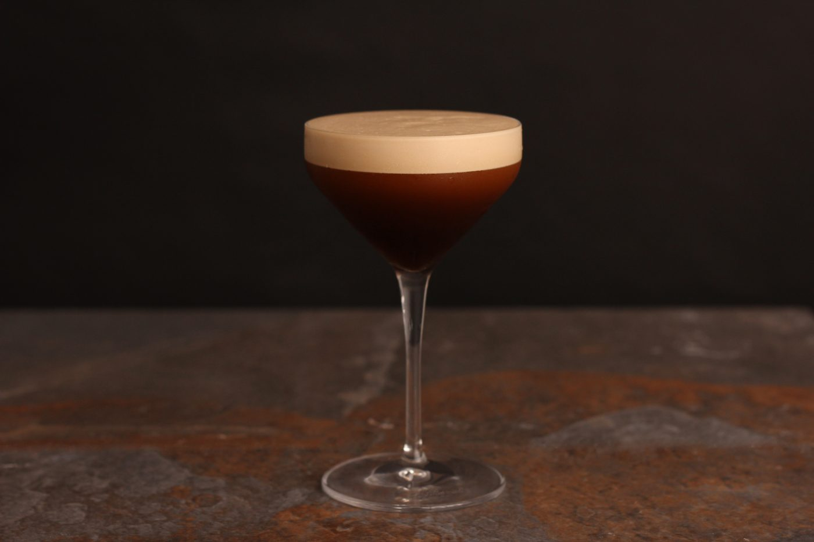

Espresso Martini
------------------

# Ingredients:
  - 40ml Vodka (Vanilla if possible)
  - 20ml Kahlua
  - 20ml Espresso
  - 2 heaped teaspoons of sugar
  - Frothed milk or cream
  - 3 coffee beans for garnish

# Method:
  - Fill a shaker with ice cubes
  - Add all the ingredients
  - Shake
  - Strain into cocktail glass
  - Garnish with coffee beans